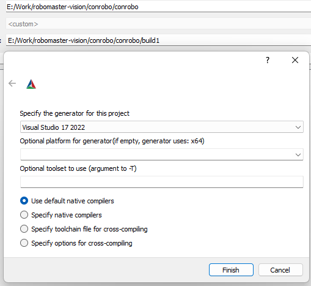
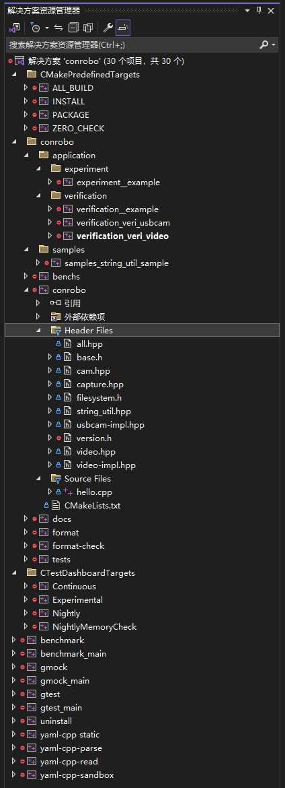
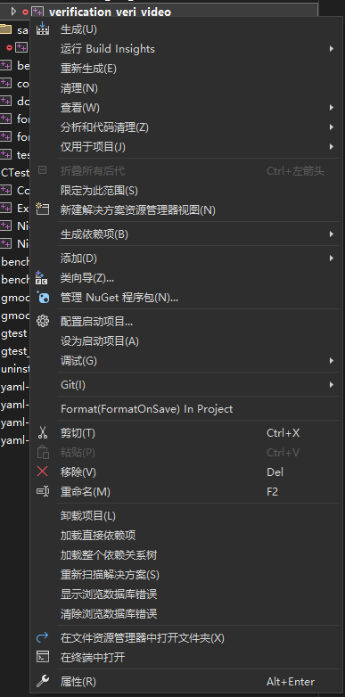
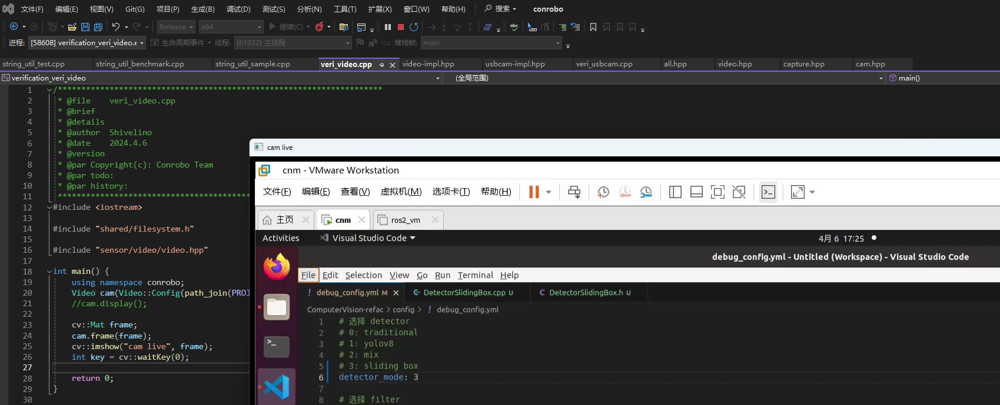

# Contributing to us

---

## 1，项目约束

- 文件编码：UTF8-BOM
- 开发平台：CMake3.27+，VS2019+
- C++标准：C++20
- 代码风格：以Google风格为主，详见[.clang-format](./.clang-format)和[.cmake-format](.cmake-format)文件


## 2，开发

### 2.1 环境搭建

安装CMake3.27或更新版本以及Visual Studio 2019或更新版本，可选安装[FileEncoding](https://marketplace.visualstudio.com/items?itemName=genrwoody.FileEncoding)和[Format On Save](https://marketplace.visualstudio.com/items?itemName=WinstonFeng.FormatonSave)插件。这两个插件可以方便地保证项目的编码一致性。


### 2.2 构建

使用git命令将源代码克隆至本地：

```bash
git clone https://github.com/Shivelino/conrobo.git
```

使用CMake图形化界面点击左下角generate，选择你想要用的构建器（图中为VS2022，即windows+vs+msvc工具链）。如果构建报错说明没有装`OpenCV`，设置一下`OpenCV_DIR`即可，不懂的可以随时联系`shivelino@qq.com`



构建完成后打开`build1/conrobo.sln`得到如图所示的项目



右键`conrobo`文件夹中的项目，右键选择`生成`或者`设为启动项目`。`生成`的意思是编译这个项目，`设为启动项目`的意思是如果这个项目是可执行文件，那么设置这个项目作为启动的项目（可以理解为执行对应的`main`函数）。



执行效果如下图所示



**ATTENTION** : Linux与Mac暂未测试，如果有问题请在仓库提Issue。不过我用`Win+Ninja+Clang`编译没有出现问题，因此我认为出概率的问题不大。


## 3，现有缺陷

- 暂无


## 4，Todo
- [x] 3rdparty include
- [ ] sensor
  - [x] cam/video
  - [ ] image sequence
